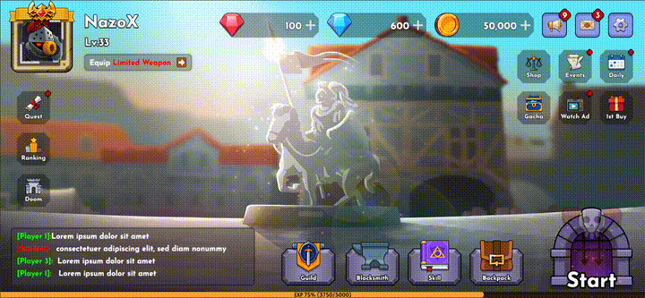

# SEA-002 Cocos Practice

## Practice 2: Create Setting and Ranking popup

## Homework 1: Practice with Label, Font, Sprite, Audio

### [Research: Wrap mode, Filter Mode and Premultiply Alpha; Auto Atlas](./homework/research/README.md#research-1---may-21-2025)

## Practice 1: Create a game lobby UI with animation
